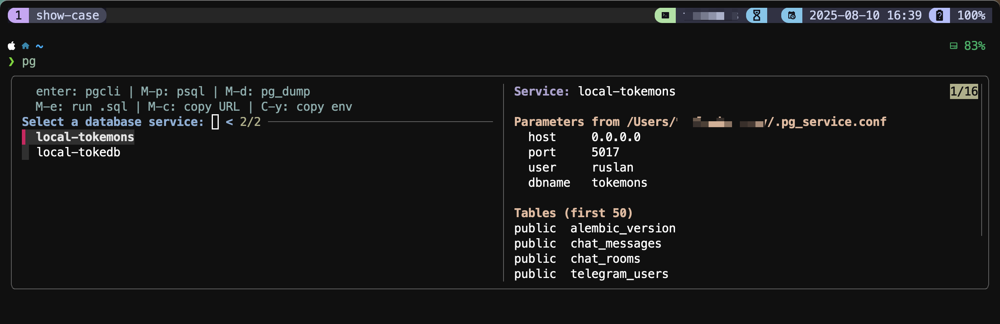

# PGconnect (pgfz) — FZF-powered PostgreSQL service picker for zsh


PGconnect is a small zsh plugin/utility that lets you:

-  Browse services from your pg_service.conf with fzf
-  See live preview of the service parameters and the first N tables
-  Connect with pgcli or psql
-  Dump the database (pg_dump)
-  Run a .sql file against the selected service
-  Copy a best‑effort PostgreSQL URL or PGSERVICE=… to your clipboard

All actions are available as hotkeys inside fzf—no need to leave the picker.


### [Watch the show-case on youtube:](http://www.youtube.com/watch?feature=player_embedded&v=iYT-D1iLLtM)

<a href="http://www.youtube.com/watch?feature=player_embedded&v=iYT-D1iLLtM
" target="_blank"></a>

---

## Demo (what you get)

-  Left: list of services from your pg_service.conf
-  Right (preview): selected service parameters + a query listing the first N tables
-  Keys (customizable):
  - Enter: connect with pgcli
  - Ctrl-P: connect with psql
  - Alt-D: pg_dump to a timestamped file/dir
  - Alt-E: pick a .sql file and run it with psql -f
  - Alt-C: copy a PostgreSQL URL (no password)
  - Ctrl-Y: copy PGSERVICE=… for quick exports

Note: fzf supports a single preview pane; PGconnect renders both “parameters” and “tables” stacked in that preview.

---

## Requirements

-  zsh (tested on 5.9+)
-  fzf (tested on 0.54.2)
-  PostgreSQL client tools:
  - psql (for preview, connect, execute)
  - pg_dump (for dumps; optional)
  - pgcli (optional; used for the Enter action by default)
-  Optional helpers:
  - column (for pretty tabular preview)
  - fd (faster .sql file search; else falls back to find)
  - Clipboard: pbcopy (macOS) or wl-copy (Wayland) or xclip (X11)

---

## Installation

To install the PostgreSQL Connection Plugin, follow these steps:

1. Clone the repository into your custom Oh My Zsh plugins directory:

   ```zsh
   git clone git@github.com:ruslan-korneev/pgconnect-zsh.git ${ZSH_CUSTOM:-~/.oh-my-zsh/custom}/plugins/pgconnect
   ```

2. Add `pgconnect` to the list of plugins in your `.zshrc` file:

   ```zsh
   plugins=(... pgconnect)
   ```

3. Reload your Zsh configuration:

   ```zsh
   source ~/.zshrc
   ```


---

## Quick start

1) Ensure you have a pg_service.conf (default: ~/.pg_service.conf). Example:

```ini
[dev]
host=localhost
port=5432
user=devuser
dbname=devdb

[prod]
host=prod-db.example.com
port=5432
user=app
dbname=appdb
sslmode=require
```

2) Optional: set up ~/.pgpass for passwordless connections in preview/exec:

```
hostname:port:database:username:password
```

3) Launch `pgfz` (`pgconnect` command is obsolete, but you can still run it):
-  If sourced as a plugin: run `pgfz`
-  If executable: run `./pgcli-connect-db.zsh`

Pick a service, then press a hotkey for the desired action.

---

## Key bindings (inside fzf)

| Key    | Action                          |
|:-------|:--------------------------------|
| Enter  | Connect with pgcli              |
| Alt-P | Connect with psql               |
| Alt-D  | Dump with pg_dump               |
| Alt-E  | Pick a .sql file and run it     |
| Alt-C  | Copy a PostgreSQL URL           |
| Ctrl-Y | Copy PGSERVICE=…                |

Notes:
-  Alt may be labeled Meta; in many terminals it’s the Option key on macOS.
-  You can still press Enter with no modifier to select + connect (pgcli by default).

---

## Environment variables

All are optional; sensible defaults are provided.

| Variable                 | Description                                                                 | Default                    |
|:-------------------------|:----------------------------------------------------------------------------|:---------------------------|
| PGFZ_SERVICE_CONF        | Path to pg_service.conf                                                      | $HOME/.pg_service.conf     |
| PGFZ_PGCLI_CMD           | pgcli-compatible client for Enter action                                    | pgcli                      |
| PGFZ_PGCLI_ARGS          | Extra args passed to pgcli after service=…                                  | (empty)                    |
| PGFZ_PSQL_CMD            | psql binary                                                                 | psql                       |
| PGFZ_PGDUMP_CMD          | pg_dump binary                                                              | pg_dump                    |
| PGFZ_FZF_PROMPT          | fzf prompt text                                                             | Select a database service: |
| PGFZ_FZF_COMMON_OPTS     | Baseline fzf options (prepended; can be overridden later)                   | (empty)                    |
| PGFZ_FZF_OPTS            | Additional fzf options (appended)                                           | (empty)                    |
| PGFZ_PREVIEW_TABLE_LIMIT | How many tables to list in preview                                          | 50                         |
| PGFZ_PREVIEW_TIMEOUT     | PGCONNECT_TIMEOUT in seconds for preview query                              | 2                          |
| PGFZ_DUMP_DIR            | Where dumps are written                                                      | .                          |
| PGFZ_DUMP_FORMAT         | pg_dump format: c (custom), p (plain), d (directory), t (tar)               | c                          |
| PGFZ_CLIP_CMD            | Clipboard command override (e.g., pbcopy, "xclip -selection clipboard")     | auto-detect                |

Tips:
-  To speed up previews on slow links, lower PGFZ_PREVIEW_TIMEOUT and PGFZ_PREVIEW_TABLE_LIMIT.
-  To change UI layout/size, use PGFZ_FZF_OPTS to adjust the preview window (examples below).

---

## Usage examples

-  Basic
  - pgfz
  - Select service → Enter to open pgcli

-  Connect with psql
  - Select service → press Ctrl-P

-  Dump a database
  - export PGFZ_DUMP_DIR=~/backups
  - export PGFZ_DUMP_FORMAT=t
  - pgfz → pick service → Alt-D
  - Result file: backups/dump-<service>-YYYYMMDD-HHMMSS.tar

-  Execute a .sql file
  - pgfz → pick service → Alt-E → choose file via fzf
  - Uses psql -v ON_ERROR_STOP=1 -f file

-  Copy connection info
  - Alt-C: copies a best‑effort URL like postgresql://user@host:port/dbname
  - Ctrl-Y: copies PGSERVICE=<name> (easy to paste into env or shell)

---

## Customization

-  Change preview window position/size

  For a bottom preview at 40% height:

  ```
  export PGFZ_FZF_OPTS="--preview-window=down,40%,border-top"
  ```

-  Show more tables in preview

  ```
  export PGFZ_PREVIEW_TABLE_LIMIT=200
  ```

-  Make previews snappier

  ```
  export PGFZ_PREVIEW_TABLE_LIMIT=20
  export PGFZ_PREVIEW_TIMEOUT=1
  ```

-  Change default client (Enter action) to psql

  ```
  export PGFZ_PGCLI_CMD=psql
  export PGFZ_PGCLI_ARGS=""
  ```

-  Tweak color theme

  If you already use FZF_DEFAULT_OPTS, leave it as is. Add a small baseline with PGFZ_FZF_COMMON_OPTS and fine-tune with PGFZ_FZF_OPTS:

  ```
  export PGFZ_FZF_COMMON_OPTS="--ansi --color=16"
  export PGFZ_FZF_OPTS="--border=rounded --layout=reverse"
  ```

-  Clipboard override

  ```
  # macOS
  export PGFZ_CLIP_CMD=pbcopy

  # Wayland
  export PGFZ_CLIP_CMD=wl-copy

  # X11
  export PGFZ_CLIP_CMD="xclip -selection clipboard"
  ```

---

## How it works

-  Services are parsed from pg_service.conf and listed in fzf.
-  Preview pane shows:
  - “Parameters” parsed from the same service entry
  - “Tables”: a read-only psql query listing the first N user tables
-  Preview is non-blocking:
  - Uses PGCONNECT_TIMEOUT and psql -w to avoid password prompts
  - If a password is required and not available via .pgpass, preview prints a friendly hint
-  Actions are chosen via fzf’s --expect keys; you press a shortcut to run the action immediately.

---

## Troubleshooting

-  “No services found in ~/.pg_service.conf”
  - Ensure the file exists and has sections like [myservice]
  - Comments start with # or ;, keys are key=value

-  Preview says “cannot connect or password needed”
  - Add credentials to ~/.pgpass
  - Or set PGFZ_PREVIEW_TIMEOUT to a larger value for slow networks
  - You can still connect with Enter/Ctrl-P to be prompted interactively

-  psql not found
  - Install PostgreSQL client tools; preview and some actions need psql

-  column not found
  - Preview will still work; it just won’t be pretty-aligned

-  Key doesn’t seem to trigger inside fzf
  - Ensure your terminal sends Alt/Meta sequences (common in macOS/iTerm2/Kitty/Alacritty)
  - Inside fzf, the bindings listed in the header should work as-is

---

## Security notes

-  pgfz never reads or stores passwords itself.
-  Preview runs with psql -w, so it won’t prompt. If .pgpass contains credentials, preview will connect and list tables.
-  The copied URL (Alt-C) does not include a password; it’s a best‑effort URL built from service fields.
-  If you set PGFZ_CLIP_CMD, pgfz will pipe to it. This is trusted user input; avoid setting it to unsafe shell fragments.

---

## FAQ

-  Can I have two separate preview panes?
  - fzf shows only a single preview pane. pgfz renders both “Parameters” and “Tables” stacked in that single pane.

-  Can I multi-select services?
  - Not yet. The current script acts on a single selection. If you need batch operations (e.g., dump all selected), open an issue.

-  Will it work without pgcli?
  - Yes. Enter uses pgcli by default, but you can set PGFZ_PGCLI_CMD=psql or just use Ctrl-P.

-  Does it support tmux popups?
  - Not built-in, but easy to wrap pgfz in tmux display-popup if you prefer.

---

## Contributing

-  Issues and PRs are welcome: bug reports, feature ideas, docs, portability fixes.
-  If you propose keybinds, note potential conflicts and terminal behaviors.
-  Please keep quoting robust and preview portable (avoid shell-specific quirks in the preview body).

---

## License

-  Apache License — © Ruslan Korneev

---

## Appendix: one-liners and power tips

-  Run with a different service file for a one-off:
  ```
  PGFZ_SERVICE_CONF=./pg_service.conf pgfz
  ```

-  Favor small/fast previews over completeness:
  ```
  PGFZ_PREVIEW_TABLE_LIMIT=10 PGFZ_PREVIEW_TIMEOUT=1 pgfz
  ```

-  Change the header text and preview layout:
  ```
  export PGFZ_FZF_OPTS="--header='enter: pgcli | C-p: psql | M-d: dump | M-e: run .sql | M-c: copy URL | C-y: copy env' --preview-window=down,50%,border-top"
  ```

That’s it—enjoy fast, discoverable PostgreSQL connections from your shell!
